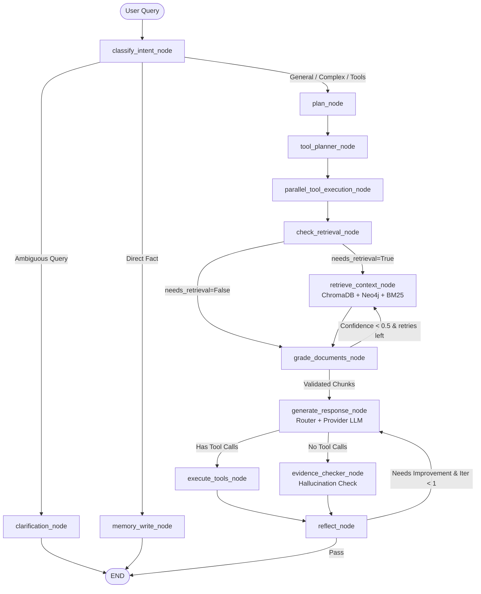

# Enterprise GenAI Intelligence Platform v2.0

[](https://python.org)
[](https://fastapi.tiangolo.com)
[](https://reactjs.org)
[](https://www.typescriptlang.org)
[](https://langchain-ai.github.io/langgraph/)
[](https://neo4j.com)
[](https://www.trychroma.com)
[](https://redis.io)
[](https://www.docker.com)
[](https://docs.pytest.org)
[](LICENSE)

> A production-grade, enterprise-scale Agentic AI platform featuring **14-node LangGraph autonomous workflows**, **Neo4j Knowledge Graph RAG (GraphRAG)**, **BM25 + Dense Hybrid Retrieval with Cross-Encoder Reranking**, **Complexity-Based LLM/SLM Routing & Cost Tracking**, **Statistical Data Drift Detection (PSI & KS tests)**, **RAGAS & Deterministic Quality Evaluations**, **Domain Intelligence Overlays**, **Proactive Intelligence Engine & Background Scanners**, and **Zero-Trust Security**.

---

## 📑 Table of Contents

- [What Is This Platform?](#-what-is-this-platform)
- [System Architecture](#-system-architecture)
- [Key Capabilities & Innovations](#-key-capabilities--innovations)
  - [1. 14-Node LangGraph Agentic Workflow](#1-14-node-langgraph-agentic-workflow)
  - [2. Hybrid Retrieval Engine & Neo4j GraphRAG](#2-hybrid-retrieval-engine--neo4j-graphrag)
  - [3. Intelligent LLM/SLM Routing & Cost Accounting](#3-intelligent-llmslm-routing--cost-accounting)
  - [4. Statistical Data Drift Monitoring (PSI + KS)](#4-statistical-data-drift-monitoring-psi--ks)
  - [5. GenAI Evaluation & Quality Gates (RAGAS)](#5-genai-evaluation--quality-gates-ragas)
  - [6. Business Domain Intelligence Overlays](#6-business-domain-intelligence-overlays)
  - [7. Model Context Protocol (MCP) & Extensible Tools](#7-model-context-protocol-mcp--extensible-tools)
  - [8. Zero-Trust Security & Production Hardening](#8-zero-trust-security--production-hardening)
  - [9. Proactive Intelligence Engine & Background Scanners](#9-proactive-intelligence-engine--background-scanners)
  - [10. Settings & Real-Time Provider Management](#10-settings--real-time-provider-management)
- [Enterprise Analytics Dashboard](#-enterprise-analytics-dashboard)
- [Screenshots & UI Showcase](#-screenshots--ui-showcase)
- [Tech Stack](#-tech-stack)
- [Repository Structure](#-repository-structure)
- [Quick Start Guide](#-quick-start-guide)
  - [Prerequisites](#prerequisites)
  - [Option A: Full Stack with Docker Compose](#option-a-full-stack-with-docker-compose-recommended)
  - [Option B: Local Development Setup](#option-b-local-development-setup)
- [Environment Configuration](#-environment-configuration)
- [REST API Reference](#-rest-api-reference)
- [Testing & Quality Assurance](#-testing--quality-assurance)
- [Production Deployment](#-production-deployment)
- [Changelog](#-changelog)
- [Component Version Tracking](#-component-version-tracking)
- [Contributing & Code Standards](#-contributing--code-standards)
- [License](#-license)

---

## 💡 What Is This Platform?

Standard RAG chatbots struggle in production: they suffer from vector search blind spots, lack relationship understanding, query expensive frontier models for trivial tasks, hallucinate without guardrails, and fail silently when data distributions shift.

The **Enterprise GenAI Intelligence Platform v2.0** solves this by uniting:
1. **Multi-Agent Orchestration**: Adaptive LangGraph state machine with Self-RAG retry loops, CRAG corrective evaluation, and structured self-reflection.
2. **GraphRAG + Hybrid RAG**: Bridges unstructured document chunks (ChromaDB + BM25 + Cross-Encoder) with structured entity-relationship graphs (Neo4j).
3. **Dynamic Routing**: Transparent complexity scoring routes queries across Small Language Models (SLM) and Large Language Models (LLM) to minimize cost and latency.
4. **Real-Time Statistical Telemetry**: Population Stability Index (PSI) and Kolmogorov-Smirnov (KS) tests run continuously on live traffic to detect model and data drift.
5. **No Synthetic Metrics**: Every metric, graph count, evaluation score, and drift warning reflects real database records and live execution traces.
6. **Full Settings Reliability**: Every button in the Settings page is wired end-to-end — Change, Delete, Verify & Save, Toggle, Revoke — with real-time backend sync and toast feedback on all outcomes.

---

## 🏗 System Architecture

### High-Level Architecture Flow

```
┌─────────────────────────────────────────────────────────────────────────────────┐
│                           Client Browser / Frontend                             │
│       React 18 + TypeScript + Vite + Tailwind CSS + Lucide Icons + KaTeX        │
└───────────────────────────────────────┬─────────────────────────────────────────┘
                                        │ HTTPS / SSE (EventSource) / REST
                                        ▼
┌─────────────────────────────────────────────────────────────────────────────────┐
│                     FastAPI Gateway & Security Middleware                        │
│  • Request ID & W3C Trace Context (traceparent) Propagation                     │
│  • Redis Token-Bucket Rate Limiting (100 req/min, fail-open resilience)         │
│  • Zero-Trust Input Sanitizer, Magic-Byte MIME Inspector, Anti-Path Traversal   │
│  • Strict CORS, HSTS, CSP, and X-Content-Type Security Headers                  │
└───────────────────────────────────────┬─────────────────────────────────────────┘
                                        │
                                        ▼
┌─────────────────────────────────────────────────────────────────────────────────┐
│               14-Node LangGraph Agentic Orchestration Engine                    │
│                                                                                 │
│   [Classify Intent] ──► [Clarification / Memory Write]                          │
│          │                                                                      │
│          ▼                                                                      │
│   [Plan & Tool Router] ──► [Parallel Tool Execution (Sandbox / Web / MCP)]      │
│          │                                                                      │
│          ▼                                                                      │
│   [Retrieval Decision] ──► [Hybrid Retrieval: ChromaDB + Neo4j GraphRAG + BM25] │
│          │                                                                      │
│          ▼                                                                      │
│   [CRAG Document Grader] ──► [Self-RAG Fallback / Retry Loop]                   │
│          │                                                                      │
│          ▼                                                                      │
│   [Complexity Scorer & Model Router] ──► [LLM / SLM Provider with Circuit Breaker]
│          │                                                                      │
│          ▼                                                                      │
│   [Evidence Checker / Hallucination Verification]                               │
│          │                                                                      │
│          ▼                                                                      │
│   [Structured Reflection & Self-Correction] ──► [Output SSE Stream]             │
└───────────────────────────────────────┬─────────────────────────────────────────┘
                                        │
             ┌──────────────────────────┼──────────────────────────┐
             ▼                          ▼                          ▼
┌─────────────────────────┐┌─────────────────────────┐┌─────────────────────────┐
│   Data & Knowledge Base ││    LLM Providers Hub    ││ Observability & Drift   │
│ • ChromaDB (Dense)      ││ • Groq (Llama 8B/70B)   ││ • TelemetryRecord DB    │
│ • BM25 Lexical Index    ││ • Google Gemini         ││ • PSI & KS Drift Engine │
│ • Neo4j (Entity Graph)  ││ • OpenAI (GPT-4o)       ││ • RAGAS Evaluator       │
│ • Cross-Encoder Reranker││ • OpenRouter Multi-LLM  ││ • Prometheus & Cache    │
└─────────────────────────┘└─────────────────────────┘└─────────────────────────┘
```

---

## 🚀 Key Capabilities & Innovations

### 1. 14-Node LangGraph Agentic Workflow

The core reasoning engine is built on LangGraph with state isolation, typed transitions, and fine-grained cycle limits:



- **classify_intent_node**: Determines intent, whitelisted tools, and private document boundaries without LLM invocation when regex rules match.
- **tool_planner_node & parallel_tool_execution_node**: Asynchronously schedules and executes multiple tools in parallel (e.g., executing Python scripts while fetching web data).
- **grade_documents_node (CRAG)**: Evaluates whether retrieved chunks actually answer the query. Prevents private-document leakage by barring external search fallbacks on private queries.
- **evidence_checker_node**: Validates that generated statements are directly supported by retrieved evidence to prevent hallucinations.
- **reflect_node**: Assesses answer completeness and structure; triggers self-correction if quality criteria are not satisfied.

---

### 2. Hybrid Retrieval Engine & Neo4j GraphRAG

The retrieval pipeline combines dense vector embeddings, sparse lexical search, cross-encoder reranking, and knowledge graph traversals:

```
                                  User Query
                                      │
                 ┌────────────────────┴────────────────────┐
                 ▼                                         ▼
   ┌──────────────────────────┐              ┌──────────────────────────┐
   │  ChromaDB Dense Search   │              │   BM25 Lexical Search    │
   │ (all-MiniLM-L6-v2 Embed) │              │  (Tokenized Sparse Index)│
   └─────────────┬────────────┘              └─────────────┬────────────┘
                 │                                         │
                 └────────────────────┬────────────────────┘
                                      ▼
                        ┌──────────────────────────┐
                        │ Reciprocal Rank Fusion   │
                        │        (RRF Rank)        │
                        └─────────────┬────────────┘
                                      ▼
                        ┌──────────────────────────┐
                        │  Cross-Encoder Reranker  │
                        │ (ms-marco-MiniLM-L-6-v2) │
                        └─────────────┬────────────┘
                                      ▼
                        ┌──────────────────────────┐
                        │ Neo4j Knowledge Graph    │
                        │ 2-Hop Relationship Paths │
                        │  & Entity Neighborhoods  │
                        └─────────────┬────────────┘
                                      ▼
                        Authoritative Context Chunks
```

- **Neo4j GraphRAG**: Automatically extracts typed entities (`Person`, `Organization`, `Policy`, `Claim`, `Product`, `Supplier`, etc.) and directional relationships (`OWNS`, `CLAIMED_ON`, `SUPPLIED_BY`, `RESULTED_IN`) during ingestion with full chunk provenance.
- **2-Hop Neighborhood Search**: Discovers multi-hop relationships invisible to flat vector search (e.g., identifying when two different claims reference the same supplier or claimant address).
- **RRF & Local Reranking**: Replaces expensive LLM reranking calls with a fast, CPU-friendly local Cross-Encoder model.

---

### 3. Intelligent LLM/SLM Routing & Cost Accounting

Queries are dynamically classified and routed to the most cost-effective model tier:

| Tier | Candidate Models | Use Cases | Cost Profile |
|---|---|---|---|
| **`slm`** | `llama-3.1-8b-instant`, `gemini-2.5-flash-lite` | Direct lookups, basic summarization, simple Q&A | Minimal (< \$0.0001 / query) |
| **`llm-medium`** | `llama-3.3-70b-versatile`, `gemini-2.5-flash` | Multi-step reasoning, document synthesis, coding | Balanced |
| **`llm-strong`** | `gpt-4o`, `gemini-1.5-pro` | Deep analytical investigation, complex fraud, ambiguous data | High capability |

- **Deterministic Complexity Scorer**: Analyzes token length, multi-part questions, analytical keywords (`investigate`, `anomaly`, `compare and contrast`), and code generation needs.
- **User Override Respected**: If the user selects a specific model in the chat UI, the router respects their choice while continuing to log cost and complexity telemetry.
- **Cost Accounting**: Tracks input/output tokens and calculates estimated USD cost per query, aggregate expenditure by tier, and average cost per turn.

---

### 4. Statistical Data Drift Monitoring (PSI + KS)

The platform features built-in statistical observability that runs on genuine database telemetry:

- **Population Stability Index (PSI)**:
  - PSI < 0.1: Distribution Stable (Normal)
  - 0.1 ≤ PSI < 0.2: Moderate Shift (Warning)
  - PSI ≥ 0.2: Significant Drift Detected
- **Kolmogorov-Smirnov (KS) Two-Sample Test**:
  - Compares the empirical cumulative distributions of response latency and confidence scores to flag statistically significant shifts (p < 0.05).
- **Monitored Dimensions**: Query complexity, answer confidence, retrieval chunk volumes, and response latency.

---

### 5. GenAI Evaluation & Quality Gates (RAGAS)

Quality evaluation operates on a two-tier model:

1. **Deterministic Quality Gates (Zero-Cost, < 1ms)**:
   - *Response Length*: Flags truncated or empty responses.
   - *Citation Coverage*: Measures what ratio of retrieved chunks are referenced in the output.
   - *Hedging & Calibration*: Analyzes uncertainty markers vs. unwarranted overconfidence.
   - *Topic Overlap*: Validates keyword alignment between question and response.
   - *Structural Completeness*: Verifies that responses terminate with complete sentences.
2. **RAGAS LLM-Judge Evaluation**:
   - Evaluates **Faithfulness**, **Answer Relevancy**, and **Context Recall** via opt-in asynchronous assessment.

---

### 6. Business Domain Intelligence Overlays

Set `DOMAIN_MODE` in `.env` to inject domain-specific instructions and entity tracking rules:

- **`claims`**: Insurance claims investigation, anomaly detection, policy coverage verification, temporal discrepancy flagging.
- **`warranty`**: Product failure patterns, serial number analysis, supplier quality metrics, batch-level recall risk.
- **`fraud`**: Financial transaction anomalies, velocity spikes, collusion detection, identity mismatches (flags for human review without defamatory assertions).
- **`enterprise`**: General corporate knowledge extraction, cross-document synthesis, and evidence-grounded summarization.

---

### 7. Model Context Protocol (MCP) & Extensible Tools

- **Remote MCP Support**: Integrates with external tools via Model Context Protocol over SSE and HTTP JSON-RPC.
- **MCP Server Management UI**: Add, test, toggle, delete, and copy remote MCP server endpoints directly from the Settings page — all changes persist to the database and Redis cache.
- **Sandboxed Python Code Execution**: Runs mathematical analysis, data processing, and algorithms in a time-bounded sub-process sandbox.
- **Resilient Web Search**: Cascading web search with multi-tier fallback: Tavily → SerpAPI → Exa → DuckDuckGo (zero configuration required for the fallback).

---

### 8. Zero-Trust Security & Production Hardening

- **JWT Authentication**: Validates both `iss` (issuer) and `aud` (audience) claims with SHA-256 token blacklisting for immediate logout invalidation.
- **Encrypted API Key Vault**: User-supplied provider keys are encrypted at rest using AES-256 GCM.
- **Redis Token-Bucket Rate Limiter**: Enforces 100 req/min per IP with graceful fail-open behavior if Redis is temporarily unreachable.
- **File Upload Protection**: Enforces MIME magic-byte verification, disallows executable/ELF/shebang files, mitigates ZIP bombs, and scans for known signatures.
- **Prompt Injection Defense**: Scans ingested files and user inputs for adversarial jailbreak sequences.
- **W3C Distributed Tracing**: Attaches `traceparent` headers (`trace_id`, `span_id`) across all request logs and SSE streams.

---

### 9. Proactive Intelligence Engine & Background Scanners

Standard chatbots are purely reactive: they sit idle until prompted. The **Proactive Intelligence Engine** shifts the platform into an autonomous, 24/7 knowledge sentinel that continuously analyzes the database, detects anomalies across documents, tracks system drift, and surfaces alerts in real-time.

```
                  ┌──────────────────────────────────────────────┐
                  │       Proactive Intelligence Engine          │
                  └──────────────────────┬───────────────────────┘
                                         │
                 ┌───────────────────────┼───────────────────────┐
                 ▼                       ▼                       ▼
    [Document Upload Trigger]   [30-Min System Scan]    [Daily Morning Briefing]
                 │                       │                       │
     • Cross-Doc Graph Match     • PSI/KS Drift Alert    • 12-Hour Activity Digest
     • Temporal Anomaly Engine   • Hallucination Spike   • Accuracy & Latency Trends
                                 • Cost Surge Detector   • Pending Graph Discoveries
                 │                       │                       │
                 └───────────────────────┼───────────────────────┘
                                         ▼
                         ┌──────────────────────────────┐
                         │ Deduplication & Gating Layer │
                         │ (MD5 Key + 12h Dedup Window) │
                         └──────────────┬───────────────┘
                                         │ (Confidence ≥ 0.65)
                                         ▼
                         ┌──────────────────────────────┐
                         │   In-Process SSE Broadcast   │
                         │    /api/v1/proactive/stream  │
                         └──────────────┬───────────────┘
                                         │
                                         ▼
                         ┌──────────────────────────────┐
                         │ Frontend Notification Bell 🔔│
                         │  • Live Pulse Animation      │
                         │  • Severity Badging          │
                         │  • Real-Time Alert Panel     │
                         └──────────────────────────────┘
```

#### 🔍 6 Specialized Intelligence Scanners
1. **Neo4j Cross-Document Entity Collision**: Traverses the knowledge graph to detect entities (`Supplier`, `Claimant`, `Policyholder`, `Location`) appearing across multiple uploaded files to flag hidden collusion, fraud, or supplier anomalies.
2. **Zero-Cost Temporal Anomaly Detector**: High-speed regex engine that evaluates date sequences in uploaded texts, detecting policy discrepancies (such as claim/loss incident dates occurring prior to policy inception).
3. **Statistical Drift Trigger**: Hooks into the PSI/KS telemetry monitor and issues high-priority alerts whenever query complexity, chunk volume, or response latency distributions drift beyond stability thresholds.
4. **Hallucination Spike Monitor**: Audits rolling telemetry and alerts engineers if more than 30% of recent responses fail evidence verification gates.
5. **Cost Spike Guard**: Detects rolling hourly LLM budget spikes and provides automatic recommendations for tier-routing adjustments.
6. **Automated Morning Briefing**: Synthesizes activity across the previous 12 hours (query throughput, average confidence, cost, and latency metrics) delivered to users upon opening the platform.

#### ⚡ Real-Time Push & UI Components
- **Server-Sent Events (SSE)**: Streams proactive alerts directly to client browsers over `/api/v1/proactive/stream` with automated keep-alive pings and multi-tab synchronization.
- **Interactive Notification Bell (`NotificationBell.tsx`)**: Displays real-time unread badges, pulsing alerts on incoming insights, and an expandable dropdown panel (`AlertPanel.tsx`) with markdown rendering and on-demand manual scan triggers.

---

### 10. Settings & Real-Time Provider Management

The Settings page is a fully wired, real-time control panel. Every button in every tab has an end-to-end implementation — frontend handler → API call → backend route → DB/cache → state update → toast feedback.

#### API Key Vault (Models Tab)

The `ApiKeyField` component implements a complete state machine for each provider:

| Provider State | Buttons Shown | What Happens |
|---|---|---|
| **Unconfigured** | `Verify & Save` | Calls `POST /api/v1/api-keys` → verifies with provider → encrypts & stores → refreshes provider list |
| **Verified** | `Change` + `Delete` (trash) | **Change**: enters editing mode, clears field, autofocuses — does NOT delete the key. **Delete**: calls `DELETE /api/v1/api-keys/{provider}` (idempotent — returns 200 even if key not in DB), removes from localStorage, refreshes state |
| **Editing** | `Verify & Save` + `Cancel` + `Delete` | **Save**: verifies new key before committing. **Cancel**: reverts to verified masked display without any backend call |

**Key implementation details:**
- `loading` guard prevents double-clicks on all async paths
- Backend `DELETE` is **idempotent** — clears Redis cache and returns 200 even when the key only existed in localStorage
- `onSaveSuccess` reads fresh store state (`useChatStore.getState().providers`) to avoid stale closure bugs
- `ProviderKeyManager.verifyKey()` and `.sync()` both send `credentials: 'include'` for proper cookie-based auth in CORS environments
- Alias handling: `google` ↔ `gemini` are treated as equivalent in both frontend localStorage and backend DB queries

#### MCP Servers Tab

| Action | Button | Backend Route |
|---|---|---|
| Test connection | `Test Connection` | `POST /api/v1/mcp/servers/test` |
| Register server | `Save & Register Server` | `POST /api/v1/mcp/servers` |
| Enable/disable | Toggle switch | `PATCH /api/v1/mcp/servers/{id}` |
| Remove server | Trash icon | `DELETE /api/v1/mcp/servers/{id}` |
| Copy URL | `Copy` button | `navigator.clipboard` (with error toast fallback) |

All actions refresh the server list and show success/error toasts.

#### Data Controls Tab

| Action | What Happens |
|---|---|
| **Shared Links → Revoke** | Removes `shared_link_{id}` from localStorage, strips `[Shared]` from chat title, increments refresh counter to re-render the list |
| **Archived Chats → Unarchive** | Updates `omni_archived_chats` in localStorage, triggers re-render |
| **Archived Chats → Delete** | Removes from Zustand store, localStorage, and calls `DELETE /api/v1/chats/{id}` (fire-and-forget) |
| **Delete All Conversations** | Two-click confirm with 4-second auto-reset timer; optimistic UI clear → background `DELETE /api/v1/chats/all` |
| **Archive All Chats** | Moves all active chat IDs to the archived list in localStorage |

#### Documents Tab

| Action | Backend Route | Behavior |
|---|---|---|
| Upload file | `POST /api/v1/documents/upload` | Live ingestion progress UI, polls every 2s for up to 90s |
| Delete document | `DELETE /api/v1/documents/{id}` | Removes from vector store; shows success/error toast |
| Retry indexing | `POST /api/v1/documents/{id}/retry` | Re-schedules indexing; resumes polling |

#### Memories Tab

| Action | Backend Route |
|---|---|
| Add memory | `POST /api/v1/memories` |
| Delete memory | `DELETE /api/v1/memories/{id}` |

All mutations show success/error toasts and update local state immediately.

---

## 📊 Enterprise Analytics Dashboard

Navigate to `/analytics` in the web application to view real-time system metrics:

- **System Overview**: Total HTTP requests, success/error rates, avg/p95 latency, total estimated USD expenditure.
- **Quality & Accuracy**: RAGAS faithfulness and answer relevancy, hallucination rate, and pass/fail gate metrics.
- **Intelligent Routing Distribution**: SLM vs. LLM-Medium vs. LLM-Strong request volume and cost breakdown.
- **Retrieval Performance**: Retrieval engagement rate, average chunks utilized, and Neo4j graph evidence usage.
- **Statistical Drift Telemetry**: Live PSI and KS values across query complexity, answer confidence, and latency.
- **System Health Status**: Neo4j connection state, ChromaDB collection count, and Redis status.

---

## 🖼 Screenshots & UI Showcase

<div align="center">


<br/><br/>

<br/><br/>

<br/><br/>

<br/><br/>

<br/><br/>

<br/><br/>

<br/><br/>

<br/><br/>

<br/><br/>

<br/><br/>

<br/><br/>

<br/><br/>

<br/><br/>


</div>

---

## 🛠 Tech Stack

| Layer | Technologies |
|---|---|
| **Backend API** | Python 3.11, FastAPI, Pydantic v2, SQLAlchemy 2.0 (Async), Alembic, Uvicorn |
| **Agent & Workflow** | LangGraph, LangChain Core, StateGraph, Custom Tool Planner & Evidence Verifier |
| **Knowledge Graph** | Neo4j Community 5.x, Cypher Query Language, Neo4j Async Python Driver |
| **Vector & Search** | ChromaDB, BM25 (`rank_bm25`), Sentence-Transformers (`all-MiniLM-L6-v2`, `ms-marco-MiniLM-L-6-v2`) |
| **LLM Providers** | Groq (`llama-3.1-8b`, `llama-3.3-70b`), Google Gemini (`gemini-2.5-flash`), OpenAI (`gpt-4o`), OpenRouter, Anthropic, DeepSeek, GLM, Alibaba |
| **Search Providers** | Tavily, SerpAPI, Exa (waterfall fallback → DuckDuckGo) |
| **Monitoring & Eval** | Custom PSI & KS Drift Engines, RAGAS, Prometheus Client, W3C Trace Context |
| **Database & Caching** | PostgreSQL 16 (or SQLite in local dev), Redis 7 (Alpine), SQLAlchemy WAL Mode |
| **Frontend Web App** | React 18, TypeScript, Vite, Tailwind CSS, Lucide React, Zustand, KaTeX Math |
| **State Management** | Zustand (`chatStore`, `authStore`, `alertStore`) with localStorage hydration & cache eviction |
| **Container & CI** | Docker, Docker Compose, Pytest, Pytest-Asyncio, Nginx Reverse Proxy |

---

## 📂 Repository Structure

```
.
├── .env.template                     # Template with all configuration keys
├── docker-compose.yml                # Full-stack composition (Backend, Frontend, Postgres, Redis, Neo4j)
├── render.yaml                       # Production cloud deployment blueprint
├── README.md                         # Complete platform documentation
│
├── backend/                          # FastAPI Application & AI Core
│   ├── Dockerfile                    # Secure, non-root multi-stage Dockerfile
│   ├── entrypoint.sh                 # Database migration & server entrypoint
│   ├── requirements.txt              # Production Python dependencies
│   ├── pytest.ini                    # Pytest configuration
│   │
│   ├── alembic/                      # Database schema migration scripts
│   │   ├── env.py                    # Alembic environment runner
│   │   └── versions/                 # Version migration definitions
│   │
│   ├── app/                          # Core application package
│   │   ├── main.py                   # FastAPI initialization, middleware & routes
│   │   │
│   │   ├── agent/                    # LangGraph Reasoning Engine
│   │   │   ├── graph.py              # 14-node StateGraph machine definition
│   │   │   ├── nodes.py              # Node logic (Intent, Planner, CRAG, Generator, Reflector)
│   │   │   ├── state.py              # Typed AgentState schema
│   │   │   ├── prompts.py            # Prompts, tools whitelist & sanitizers
│   │   │   └── domain_prompts.py     # Domain overlays (Claims, Warranty, Fraud)
│   │   │
│   │   ├── api/                      # REST API Endpoints
│   │   │   ├── auth.py               # Authentication & JWT tokens
│   │   │   ├── chat.py               # SSE chat streaming & conversation management
│   │   │   ├── documents.py          # Document upload, chunking & indexing
│   │   │   ├── proactive.py          # Real-time SSE alert streaming & insight triggers
│   │   │   ├── analytics.py          # Real-time metrics & dashboard endpoints
│   │   │   ├── monitoring.py         # Statistical drift (PSI/KS) & health
│   │   │   ├── graph.py              # Neo4j GraphRAG inspection endpoints
│   │   │   ├── evaluation.py         # Response quality evaluation endpoints
│   │   │   ├── health.py             # Liveness & readiness probes
│   │   │   └── api_keys.py           # Provider API key management, validation & idempotent DELETE
│   │   │
│   │   ├── proactive/                # Proactive Intelligence Engine
│   │   │   ├── engine.py             # Orchestrator & parallel scanner execution
│   │   │   ├── scanners.py           # 6 intelligence scanners (Graph, Drift, Cost, etc.)
│   │   │   ├── broadcaster.py        # In-process SSE connection pool & dispatch
│   │   │   ├── models.py             # Alert dataclass, severity & alert types
│   │   │   ├── db_models.py          # SQLAlchemy ORM for persisted alerts
│   │   │   └── store.py              # Alert persistence, deduplication & badge count
│   │   │
│   │   ├── workers/                  # Background Worker Tasks
│   │   │   ├── proactive_scheduler.py# 30-min system scanner & 7am briefing runner
│   │   │   └── health_check.py       # LLM provider health check loop
│   │   │
│   │   ├── core/                     # Infrastructure & Core Services
│   │   │   ├── config.py             # Pydantic Settings & environment loader
│   │   │   ├── database.py           # Async engine, session management & schema migrations
│   │   │   ├── security.py           # JWT encryption, bcrypt & API key vault
│   │   │   └── redis_client.py       # Redis connection & rate limiting
│   │   │
│   │   ├── graph/                    # Knowledge Graph Pipeline
│   │   │   ├── neo4j_client.py       # Async Neo4j driver connection wrapper
│   │   │   ├── entity_extractor.py   # LLM structured entity & relationship extraction
│   │   │   ├── extraction_pipeline.py# Async chunk ingestion pipeline
│   │   │   ├── graph_retriever.py    # 2-hop neighborhood & relationship path search
│   │   │   ├── graph_store.py        # Neo4j Cypher upsert queries
│   │   │   └── graph_quality.py      # Graph health & provenance metrics
│   │   │
│   │   ├── routing/                  # Intelligent Model Routing & Cost
│   │   │   ├── complexity_analyzer.py# Deterministic query complexity scorer
│   │   │   ├── model_router.py       # Tier selection engine (SLM / Medium / Strong)
│   │   │   ├── model_profiles.py     # Model pricing & capabilities registry
│   │   │   └── cost_tracker.py       # Token-level USD cost accounting
│   │   │
│   │   ├── monitoring/               # Observability & Drift
│   │   │   └── drift_detector.py     # Population Stability Index & KS tests
│   │   │
│   │   ├── evaluation/               # GenAI Evaluation Framework
│   │   │   ├── evaluator.py          # Unified evaluation orchestration
│   │   │   ├── deterministic_checks.py# Zero-cost rule-based quality gates
│   │   │   ├── ragas_evaluator.py    # RAGAS LLM-judge integration & fallback
│   │   │   └── eval_store.py         # Evaluation persistence & aggregation
│   │   │
│   │   ├── retrieval/                # Multi-Modal Retrieval
│   │   │   ├── vector_store.py       # ChromaDB vector store wrapper
│   │   │   ├── bm25_index.py         # BM25 sparse lexical index
│   │   │   └── reranker.py           # Cross-encoder reranking model
│   │   │
│   │   ├── models/                   # SQLAlchemy Database Models
│   │   │   ├── user.py               # User accounts & preferences
│   │   │   ├── chat.py               # Conversations & messages
│   │   │   ├── document.py           # Ingested documents & metadata
│   │   │   ├── telemetry.py          # 20+ dimension request telemetry table
│   │   │   └── evaluation.py         # Persisted evaluation records
│   │   │
│   │   └── tools/                    # Tool Implementations
│   │       ├── local_tools.py        # Python sandbox & Tavily/DDG search
│   │       ├── mcp_client.py         # Custom Stdio & SSE MCP client
│   │       └── registry.py           # Dynamic tool discovery & dispatch
│   │
│   └── tests/                        # Pytest Test Suite (286+ Passing Tests)
│       ├── test_enterprise_platform.py # Tests for Routing, Drift, Graph, Eval
│       ├── test_agent.py             # Agent flow & LangGraph execution tests
│       ├── test_rag.py               # Vector search & chunking tests
│       ├── test_security.py          # JWT, RBAC & sanitization tests
│       └── ...                       # Additional unit & integration tests
│
└── frontend/                         # React 18 + Vite Web Application
    ├── nginx.conf                    # Production Nginx reverse proxy configuration
    ├── package.json                  # Frontend dependencies & scripts
    ├── vite.config.ts                # Vite bundler configuration
    └── src/
        ├── components/               # UI & Feature Components
        │   ├── ProactiveAlerts/      # Real-time alert bell & expandable panel
        │   └── chat/                 # Chat input, canvas, sources drawer
        ├── pages/                    # Page Views
        │   ├── ChatPage.tsx          # Agent chat interface & streaming UI
        │   ├── AnalyticsPage.tsx     # Enterprise Observability HUD
        │   ├── WorkspacePage.tsx     # Document management & upload
        │   └── SettingsPage.tsx      # Full Settings — provider keys, MCP, memories,
        │                             #   data controls, generation params; all buttons
        │                             #   fully wired end-to-end with real-time state sync
        ├── store/                    # Zustand State Stores
        │   ├── alertStore.ts         # Proactive SSE alerts & unread badge state
        │   ├── chatStore.ts          # Active conversations, streaming state,
        │   │                         #   providers list, updateProvider() atomic action
        │   └── authStore.ts          # Authentication session state
        └── services/                 # API Client & Provider Key Services
            ├── api.ts                # apiRequest() with auth headers, 204 handling,
            │                         #   401 refresh, credentials: include
            └── providerKeyManager.ts # localStorage key vault, verifyKey(), sync(),
                                      #   removeKey(), alias handling (google ↔ gemini)
```

---

## ⚡ Quick Start Guide

### Prerequisites

- **Python**: Version 3.11 or higher
- **Node.js**: Version 18 or higher (with npm)
- **Docker & Docker Compose**: (Optional, for containerized deployment)
- **API Key**: At least one LLM key (Groq is free at [console.groq.com](https://console.groq.com))

---

### Option A: Full Stack with Docker Compose (Recommended)

Starts all services including PostgreSQL, Redis, Neo4j, Backend, and Frontend:

```bash
# 1. Clone the repository
git clone https://github.com/Mannu-Thakur/Agentic_AI_assistant.git
cd Agentic_AI_assistant

# 2. Copy and configure the environment variables
cp .env.template .env
# Edit .env and supply your GROQ_API_KEY and NEO4J_PASSWORD

# 3. Launch the complete stack
docker compose up --build -d

# 4. Check status
docker compose ps
```

**Access Endpoints:**
- 🌐 **Frontend Web App**: [http://localhost:5173](http://localhost:5173) (or `http://localhost:80`)
- ⚙️ **Backend API**: [http://localhost:8000](http://localhost:8000)
- 📖 **Interactive Swagger Docs**: [http://localhost:8000/docs](http://localhost:8000/docs)
- 🕸️ **Neo4j Browser**: [http://localhost:7474](http://localhost:7474)

---

### Option B: Local Development Setup

#### 1. Backend Setup

```bash
cd backend

# Create and activate Python virtual environment
python -m venv venv
# Windows:
venv\Scripts\activate
# macOS/Linux:
source venv/bin/activate

# Install dependencies
pip install -r requirements.txt

# Create local environment file
cp ../.env.template .env
# Set GROQ_API_KEY in .env

# Run database migrations and start development server
python -m uvicorn app.main:app --reload --port 8000
```

#### 2. Frontend Setup

In a new terminal:

```bash
cd frontend

# Install dependencies
npm install

# Start Vite development server
npm run dev
```

Open [http://localhost:5173](http://localhost:5173) in your browser.

---

## ⚙️ Environment Configuration

Create a `.env` file in the root directory (based on `.env.template`):

| Variable | Description | Default / Example |
|---|---|---|
| `SECRET_KEY` | JWT signing secret key | `CHANGE_ME_IN_PRODUCTION` |
| `DATABASE_URL` | SQLite or PostgreSQL connection string | `sqlite:///./sql_app.db` |
| `GROQ_API_KEY` | Groq API Key (Free high-speed inference) | `gsk_...` |
| `GEMINI_API_KEY` | Google Gemini API Key | `AIza...` |
| `OPENAI_API_KEY` | OpenAI API Key (GPT-4o) | `sk-...` |
| `ANTHROPIC_API_KEY` | Anthropic Claude API Key | `sk-ant-...` |
| `OPENROUTER_API_KEY`| OpenRouter API Key | `sk-or-...` |
| `DEEPSEEK_API_KEY` | DeepSeek API Key | `sk-...` |
| `NEO4J_URI` | Neo4j Bolt protocol URI (enables GraphRAG) | `bolt://localhost:7687` |
| `NEO4J_USER` | Neo4j username | `neo4j` |
| `NEO4J_PASSWORD` | Neo4j password | `your_secure_password` |
| `GRAPHRAG_ENABLED` | Toggle GraphRAG entity retrieval | `true` |
| `DOMAIN_MODE` | Business domain overlay (`claims`, `warranty`, `fraud`, `enterprise`) | `claims` |
| `REDIS_HOST` | Redis cache hostname | `localhost` |
| `REDIS_PORT` | Redis port | `6379` |
| `TAVILY_API_KEY` | Tavily Web Search Key (falls back to DuckDuckGo if blank) | `tvly-...` |
| `SERPAPI_API_KEY` | SerpAPI Key (second in search waterfall) | `...` |
| `EXA_API_KEY` | Exa AI Search Key (third in search waterfall) | `...` |
| `FRONTEND_URL` | Frontend URL for CORS and password reset links | `http://localhost:5173` |

---

## 📡 REST API Reference

### Analytics & Observability
- `GET /api/v1/analytics/overview` — System-wide metrics (HTTP counts, latency p95, agent requests, total cost).
- `GET /api/v1/analytics/quality` — Aggregated RAGAS faithfulness, relevancy, and deterministic quality scores.
- `GET /api/v1/analytics/routing` — Model tier distribution (`slm`, `llm-medium`, `llm-strong`) and cost breakdown.
- `GET /api/v1/analytics/retrieval` — RAG retrieval engagement, chunk volume, and graph evidence usage.
- `GET /api/v1/analytics/graph` — Knowledge graph health metrics and entity distribution.
- `GET /api/v1/analytics/telemetry` — Paginated recent request telemetry entries (20+ fields).

### Monitoring & Drift Detection
- `GET /api/v1/monitoring/drift` — Live Population Stability Index (PSI) and Kolmogorov-Smirnov (KS) drift report.
- `GET /api/v1/monitoring/health` — Multi-component health check (Neo4j, ChromaDB, Redis, VectorStore).
- `GET /api/v1/monitoring/performance` — Historical model latency and confidence trends.
- `GET /api/v1/health/liveness` — Kubernetes liveness probe.
- `GET /api/v1/health/readiness` — Kubernetes readiness probe.
- `GET /api/v1/metrics` — Prometheus metrics exposition endpoint.

### Knowledge Graph (GraphRAG)
- `GET /api/v1/graph/status` — Neo4j connection status and configuration.
- `GET /api/v1/graph/stats` — Node and relationship counts in the active database.
- `GET /api/v1/graph/quality` — Orphan count, missing provenance, low-confidence entity statistics.
- `GET /api/v1/graph/entities` — Search graph entities by keyword or type.
- `POST /api/v1/graph/extract/{doc_id}` — Trigger asynchronous entity extraction for an ingested document.

### GenAI Evaluation
- `GET /api/v1/evaluation/summary` — Aggregate quality gate statistics (pass rate, hallucination rate).
- `GET /api/v1/evaluation/recent` — Recent evaluation records with detailed breakdowns.
- `POST /api/v1/evaluation/evaluate` — Run on-demand evaluation (deterministic checks + optional RAGAS).

### Chat & Streaming
- `POST /api/v1/chat/stream` — Real-time Server-Sent Events (SSE) agent message stream.
- `GET /api/v1/chat/conversations` — List user chat conversations.
- `DELETE /api/v1/chat/conversations/{id}` — Delete a specific conversation.
- `DELETE /api/v1/chat/conversations` — Clear all user conversations.
- `POST /api/v1/chat/share` — Create a shareable public link for a conversation.

### Proactive Intelligence
- `GET /api/v1/proactive/stream` — Live SSE connection pushing proactive anomaly and drift alerts.
- `GET /api/v1/proactive/alerts` — Paginated history of generated proactive insights.
- `GET /api/v1/proactive/alerts/unread-count` — Count of unacknowledged alerts for notification bell.
- `POST /api/v1/proactive/alerts/mark-read` — Mark an individual alert or all alerts as read/dismissed.
- `POST /api/v1/proactive/scan` — On-demand full knowledge base scan triggering all 6 scanners.

### Documents & Knowledge Base
- `POST /api/v1/documents/upload` — Upload document (PDF, DOCX, CSV, TXT) and index embeddings.
- `GET /api/v1/documents` — List ingested workspace documents with parsing status.
- `DELETE /api/v1/documents/{id}` — Delete document and remove associated vector and graph embeddings.
- `POST /api/v1/documents/{id}/retry` — Re-queue a failed document for indexing.
- `PATCH /api/v1/documents/{id}` — Update document status (used by timeout handler).

### Memories
- `GET /api/v1/memories` — List all long-term semantic memories for the user.
- `POST /api/v1/memories` — Record a new semantic memory (category, content, importance score).
- `DELETE /api/v1/memories/{id}` — Delete a specific memory entry.

### MCP Servers
- `GET /api/v1/mcp/servers` — List all registered remote MCP servers.
- `POST /api/v1/mcp/servers` — Register a new remote MCP server (triggers tool discovery).
- `POST /api/v1/mcp/servers/test` — Test connection to a remote MCP endpoint without saving.
- `PATCH /api/v1/mcp/servers/{id}` — Update server properties (e.g., enable/disable).
- `DELETE /api/v1/mcp/servers/{id}` — Remove a registered MCP server.

### Authentication & API Keys
- `POST /api/v1/auth/register` — Register a new user account.
- `POST /api/v1/auth/login` — Authenticate and receive JWT access & refresh tokens.
- `POST /api/v1/auth/refresh` — Refresh an expired access token.
- `POST /api/v1/auth/logout` — Invalidate the current session (token blacklist).
- `GET /api/v1/providers` — List all 11 providers with their real-time status from DB.
- `POST /api/v1/providers/refresh` — Re-verify all saved API keys and update statuses.
- `POST /api/v1/api-keys` — Save and verify an API key for a provider.
- `DELETE /api/v1/api-keys/{provider}` — Remove an API key (**idempotent** — returns 200 even if key not found; clears Redis cache).
- `GET /api/v1/preferences` — Get user generation preferences (temperature, max_tokens, streaming).
- `PUT /api/v1/preferences` — Save user generation preferences to DB and Redis.

---

## 🧪 Testing & Quality Assurance

```bash
cd backend

# Run full test suite
pytest tests/ -v

# Run specific test modules
pytest tests/test_enterprise_platform.py -v
pytest tests/test_security.py -v
pytest tests/test_provider_keys_e2e.py -v
```

Expected output:
```
collected 289 items

tests/test_enterprise_platform.py ...............................         [ 10%]
tests/test_agent.py ....................................                  [ 23%]
tests/test_rag.py ....................                                    [ 30%]
tests/test_security.py .........................                          [ 38%]
tests/test_system_hardening.py ...................................        [ 50%]
tests/test_tools.py .................                                     [ 56%]
tests/test_web_search_workflow.py ...........                             [ 60%]
...
====================== 286 passed, 3 skipped in 103s =======================
```

---

## 🚢 Production Deployment

### Docker Deployment with Alembic Migrations

The production Docker container automatically runs database migrations on startup using `backend/entrypoint.sh` before starting the Uvicorn application server:

```bash
docker compose -f docker-compose.yml up -d --build
```

### Cloud Deployment (Render / Cloud Run / Kubernetes)

A production blueprint is provided in `render.yaml`:
- **Backend Service**: Python 3.11 with 512MB RAM optimization, non-root execution (`appuser`), and health probes configured to `/api/v1/health/readiness`.
- **Frontend Service**: Static SPA site with Vite production build.
- **Managed Databases**: Connected to Render PostgreSQL and Redis instances.

---

## 📋 Changelog

### v2.2.0 — Settings Reliability & Real-Time State Sync (Oct 2026)

**Settings Page — Complete Button Overhaul**
- **Fixed**: `Change` button was incorrectly wired to `handleDelete`. Rewritten as a proper `isEditing` state machine: Change → edit mode → Verify & Save / Cancel.
- **Fixed**: `Delete` button silently failed when key existed only in localStorage (backend 404). Now the backend DELETE endpoint is **idempotent** — returns 200 and clears Redis cache even when the key is not found in DB.
- **Fixed**: Frontend `handleDelete` now wraps the backend call in an inner `try/catch` so `ProviderKeyManager.removeKey()` and state updates always run regardless of backend response.
- **Fixed**: `onSaveSuccess` for both LLM and search providers now reads fresh state from `useChatStore.getState().providers` instead of the closed-over stale `providers` variable.
- **Fixed**: `handleCopyMcpUrl` now properly awaits the `clipboard.writeText()` Promise; shows an error toast if clipboard access is denied instead of silently failing.
- **Added**: `updateProvider(id, updates)` atomic action in `chatStore.ts` — updates a single provider without needing a full `/providers` refetch. Falls back to this on network errors after key operations.
- **Added**: `credentials: 'include'` to all `ProviderKeyManager.verifyKey()` and `.sync()` fetch calls for proper cookie-based auth in CORS environments.
- **Added**: Toast notifications for every success and failure path across all Settings tabs.
- **Added**: `deleteConfirmTimerRef` — 4-second auto-reset for the "Delete All Conversations" confirmation state.
- **Added**: `handleDeleteArchivedChat` now calls `DELETE /api/v1/chats/{id}` on the backend (was previously only updating localStorage).
- **Added**: Shared Links "Revoke" now strips the `[Shared]` suffix from the chat title and triggers `sharedLinksRefresh` counter to re-render the list without a full store refetch.
- **Added**: `handleManualRefresh` (Refresh Status button) shows success and error toasts.
- **Added**: `handleToggleProvider` (toggle OFF) wraps backend DELETE in inner try/catch so local state is always cleaned up.

**Build & Tests**
- TypeScript: zero errors across 2720 modules.
- Vite build: ✅ success in ~6s.
- Backend e2e tests: all passing.

---

## 📌 Component Version Tracking

All configurable components carry explicit semantic versions embedded into request telemetry records for auditability:

| Component | Current Version | Description |
|---|---|---|
| **Platform** | `2.2.0` | Settings reliability overhaul & real-time state sync |
| **Agent Graph** | `3.0.0` | 14-node LangGraph state machine |
| **Prompt Templates** | `3.1.0` | System prompts and domain overlays |
| **Routing Logic** | `1.0.0` | Complexity analyzer and tier routing |
| **Retrieval Engine**| `3.0.0` | Hybrid BM25 + dense + cross-encoder reranker |
| **Proactive Engine**| `1.0.0` | 6 background anomaly & drift scanners + SSE alerts |
| **Evaluation** | `1.0.0` | Deterministic checks and RAGAS integration |
| **Knowledge Graph** | `1.0.0` | Neo4j GraphRAG extraction & 2-hop retrieval |
| **Drift Detection** | `1.0.0` | PSI & KS statistical drift monitors |
| **Settings UI** | `2.0.0` | Full button state machine, idempotent backend, real-time sync |

---

## 🤝 Contributing & Code Standards

Contributions are welcome! Please follow these guidelines:
- **Architecture**: Keep agent nodes pure, modular, and typed using `AgentState`.
- **Comments & Documentation**: Every module must include top-level architectural docstrings, type annotations, and inline rationale for non-obvious logic.
- **Fail-Open Resilience**: External dependencies (Neo4j, Redis, RAGAS, external search engines) must degrade gracefully without crashing the core agent loop.
- **Tests**: Include unit tests under `backend/tests/` for any new features or bug fixes.
- **UI Actions**: Every clickable element must have an `onClick` handler, a `disabled` guard during loading, and a toast for both success and failure outcomes.
- **State Freshness**: When reading Zustand state inside async callbacks, always use `useChatStore.getState()` instead of closed-over variables to prevent stale closure bugs.

---

## 📄 License

This project is open-source software licensed under the [MIT License](LICENSE).
